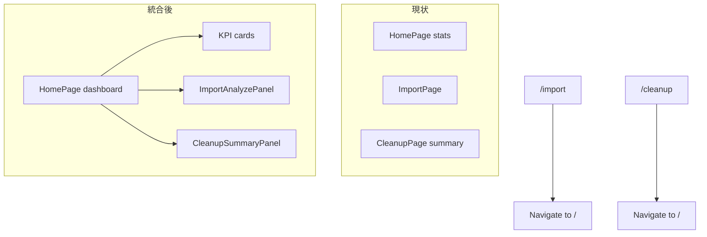

# UI問題を一つずつ解消する進め方

Cursor の計画「UI問題の逐次解消」と同一内容のエクスポートです。

## 概要

Import／Clean Up Summary を HOME に統合したダッシュボード化、Duplicates／Similar の一覧 UX、およびダッシュボード系カードを縦長にならない四角寄りタイルに揃えることを含む。

## TODO

- [ ] **fix-idle-percent-ux** — 「Idle」と進捗 % が並ぶと誤解される問題を解消（表示ロジックまたは API の idle 時パーセント）
- [ ] **import-actions-layout** — 参照・Start Scan・Start Analyze の配置・スタイルをダッシュボード用に再設計（App.css / コンポーネント分割）
- [ ] **merge-home-import** — HomePage に Import と Clean Up Summary（CleanupPage のカード＋ライブラリ概要）を統合し、/import・/cleanup・Sidebar・冗長な統計表示を整理
- [ ] **duplicates-initial-state** — Duplicates / Similar Groups の初期・読込中表示（件数チップがロード中 0 になる問題等）をロード・空・未選択で判別しやすくする
- [ ] **duplicates-layout-panes** — Duplicates / Similar のグループペインを縦型リスト化または上下分割し、サムネ／詳細との分離を改善する（共用クラスまたは共通ラッパー検討、App.css）
- [ ] **card-grid-tile-shape** — card-grid／サマリーカードを内容が少ないときも縦に伸びないよう、四角寄りタイル（aspect-ratio／min-height／内部 flex）で統一（App.css・必要ならクラス分け）

---

## いま対象にしている項目（ユーザーからのフィードバック）

1. **「Idle」「100%」の意味がわからない** — Import & Analyze（[`app/src/pages/ImportPage.tsx`](app/src/pages/ImportPage.tsx)）
2. **「参照…」「Start Scan」「Start Analyze」の配置が見づらい** — 同上 + [`app/src/App.css`](app/src/App.css)
3. **HOME と統合してダッシュボード化したい** — Import に加え **Clean Up Summary**（[`app/src/pages/CleanupPage.tsx`](app/src/pages/CleanupPage.tsx)）も同一ページへ — [`app/src/pages/HomePage.tsx`](app/src/pages/HomePage.tsx)、[`app/src/App.tsx`](app/src/App.tsx)、[`app/src/components/Sidebar.tsx`](app/src/components/Sidebar.tsx)
4. **Duplicates / Similar Groups** — 初期状態の明確化、グループ一覧の縦ペイン化または上下分割でサムネ／詳細と分離（同一方針）— [`app/src/pages/DuplicatesPage.tsx`](app/src/pages/DuplicatesPage.tsx)、[`app/src/pages/SimilarPage.tsx`](app/src/pages/SimilarPage.tsx)、[`app/src/App.css`](app/src/App.css)
5. **カード表示** — 要素が少ないとカードが縦に長く見える。**四角寄りのカード／タイル感**でそろえたい — 主に [`app/src/App.css`](app/src/App.css) の `.card-grid` / `.card`、[`CleanupPage.tsx`](app/src/pages/CleanupPage.tsx) のサマリーカード、統合後の Home

---

## 1. 「Idle」「100%」が並んで見える理由（設計上のミスマッチ）

ツールバーは **2 つの別要素** を横に並べています。

```61:68:app/src/pages/ImportPage.tsx
      <div className="toolbar">
        <div className="toolbar-group">
          <span className="status-chip">
            <span className="status-dot" />
            {status.data?.running ? 'Running' : 'Idle'}
          </span>
          <span className="muted">{status.data?.percent ?? 0}%</span>
        </div>
      </div>
```

バックエンドでは、ジョブ完了時に **`running` を false にしたあとも `percent` を 100 のまま** にしています。

```98:104:src/api_server.py
    def _run(self, target, args) -> None:
        try:
            target(*args)
            with self._lock:
                self._state.running = False
                self._state.percent = 100
                self._state.finished_at = time.time()
```

そのため「待機中（Idle）なのに 100%」と読め、**一文として「IDLE 100%」に見える**のが混乱の原因です。

**改善の方向（実装時にどちらか／併用）**

- **UI 側（最小変更）**: `running === false` のときは `%` を隠すか、「前回ジョブ完了」などラベルに変える。実行中だけ `current/total` と `%` を出す。
- **API 側**: アイドル遷移時に `percent` を 0 に戻す、または `last_job_percent` のようにフィールドを分ける（フロント型 [`app/src/types.ts`](app/src/types.ts) の `ScanJob` も追随）。

---

## 2. 操作ボタンまわりのレイアウト刷新

現状は `row` にパス入力・参照・その下の行に 2 ボタンが並ぶだけです。**ダッシュボード用途**なら例えば次のような構造が整理しやすいです。

- **カード「ライブラリ」**: ルートパス（読み取り専用表示 + 「変更」でフォルダピッカー／入力）
- **カード「ジョブ」** または **横並びアクション**: Primary を「スキャン」、Secondary を「解析」、説明文を短く添える
- **共通**: `toolbar` とカード内の `progress` を 1 カラムにまとめ、状態チップとメッセージを近接配置

スタイルは既存の `.card` / `.button` に合わせ、必要なら `.dashboard-actions` のようなブロックを [`app/src/App.css`](app/src/App.css) に追加します。

---

## 3. HOME ダッシュボード統合（Import + Clean Up Summary）

**ゴール**: 起動直後の **`/` がダッシュボード**であり、次が **同一スクロールページ**に載る。

- **ライブラリ KPI**（現 [`HomePage.tsx`](app/src/pages/HomePage.tsx) の API Status / Total / Analyzed など）
- **Import / Analyze**（現 [`ImportPage.tsx`](app/src/pages/ImportPage.tsx)）
- **Clean Up Summary**（現 [`CleanupPage.tsx`](app/src/pages/CleanupPage.tsx) の Duplicates／Blurry／Similar／Tiny のサマリーカードと「ライブラリ全体」ミニ統計）

**CleanupPage がしていること（統合時の注意）**

[`CleanupPage.tsx`](app/src/pages/CleanupPage.tsx) は `blurry`・`duplicates`・`similar`・`tiny`・`stats` の **5 本の useQuery** をまとめ、`SummaryCard` で各詳細ルートへ `Link` している。統合後は **Home で同じクエリを二重に走らせない**よう、`CleanupSummaryPanel` のようなコンポーネントに切り出して **Home だけがフェッチ**する形がよい。また下部「ライブラリ全体」（総ファイル／解析済み／ゴミ箱）は Home 上部 KPI と **内容が重複**するため、**1 か所に統合するか、ダッシュボード内で役割を分ける**（例: 上部は数字のみ、下部は Clean Up 用の文脈だけ）とスッキリする。

**ルーティング**

- [`app/src/App.tsx`](app/src/App.tsx): `HomePage` に上記ブロックを統合（または `DashboardPage` にリネーム）。
- `/import`: **`Navigate to="/" replace`**（必要なら `#import` でスクロールする実装は任意）。
- `/cleanup`: 同様に **`Navigate to="/" replace`**（任意で `#cleanup`）。

**ナビ**

- [`app/src/components/Sidebar.tsx`](app/src/components/Sidebar.tsx): 「Import & Analyze」「Clean up summary」をやめ、**「Home」または「Dashboard」** に一本化し、ツールチップで「概要・取込・解析・整理サマリー」を説明。

**実装の分割（推奨）**

- `components/ImportAnalyzePanel.tsx` — Import ブロック
- `components/CleanupSummaryPanel.tsx`（または `CleanupPage` から export するプレゼンテーション）— サマリーカード群



---

## 4. Duplicates / Similar Groups：初期状態とレイアウト（同一方針）

両画面とも **3 ペイン（グループ一覧 | サムネ | 詳細）**・**狭い左カラム + `.list-grid`**・**読込前に件数が 0 に見える**という点が共通しています。実装では **CSS とチップ表示を両ページで揃える**か、将来のために **`GroupReviewLayout` のような薄い共通ラッパー**に寄せると二度手間が減ります。

対象: [`app/src/pages/DuplicatesPage.tsx`](app/src/pages/DuplicatesPage.tsx)、[`app/src/pages/SimilarPage.tsx`](app/src/pages/SimilarPage.tsx)

### 4.1 初期／読込み中表示

**Duplicates**: `data` が無いとき `groups.length ?? 0` が **0** になり、フェッチ中でも「0 groups」と見える。

```85:88:app/src/pages/DuplicatesPage.tsx
          <span className="status-chip">
            <span className="status-dot" />
            {duplicates.data?.groups.length ?? 0} groups
          </span>
```

**Similar**: `groups = similar.data?.groups ?? []` のため、未取得時は **空配列**になり、チップは **`Groups: 0`** と表示される。

```63:76:app/src/pages/SimilarPage.tsx
  const groups = similar.data?.groups ?? []

  return (
    <section className="page">
      ...
      <div className="toolbar">
        <div className="toolbar-group">
          <span className="status-chip">
            <span className="status-dot" />
            Groups: {groups.length}
          </span>
```

（`similar.data` 未取得時も `groups` は `[]` のためチップは `0` になる。）

改善の方向（両ページ共通）: `isPending` / `isError` / 成功かつ空 / 成功かつ未選択 をチップまたはサブテキストで区別。中央の「左からグループを選択」に加え、**各ペインの見出し**（グループ一覧／グループ内ファイル／詳細）で初期状態が把握しやすくする。

### 4.2 グループ一覧が「縦型ペイン」になっていない問題

両ページとも **`gridTemplateColumns: '220px 1fr 300px'`** の左 220px に **`.list-grid`（3 列）** を置いており、**カードが潰れて一覧として読みにくい**（Duplicates のグループ一覧も同一パターン）。

```116:118:app/src/pages/SimilarPage.tsx
          <div className="list-grid">
            {!similar.isPending && !similar.isError && groups.map((group) => (
```

改善の方向（両ページで同じ構成にそろえる）:

- **案 A — 左ペインを縦スクロールの単一列リスト**: 共用クラス例 `.group-picker-list`（`flex-direction: column` または `grid-template-columns: 1fr`）。行はサムネ + 件数 + ID／ハッシュ短縮。
- **案 B — 上下分割**: 上段＝グループ一覧、下段＝「サムネ | FileDetailPane」。案 B を採る場合も **下段の 2 カラムは両ページで同じ**にするとよい。
- **案 C — 幅を確保**: 左を `minmax(260px, 28vw)` などに広げつつ案 A と組み合わせ。

実装時は [`FileDetailPane`](app/src/components/FileDetailPane.tsx) とドラッグ／選択ロジックは維持し、**グリッド構造とクラス追加が中心**になるようにする。

```mermaid
flowchart TB
  subgraph optB [案B 上下分割イメージ]
    Top[グループ一覧 縦リスト]
    Bottom[サムネエリア | 詳細ペイン]
    Top --> Bottom
  end
```

### 4.3 Similar 固有の差分（レイアウト以外）

- ツールバーに **類似度スライダー**があり、`distance` 変更で選択がリセットされる（§4.1 の状態表示と合わせて説明すると親切）。
- ゴミ箱成功後に `selectedGroupId` を null に戻すなど、選択状態のリセット挙動が Duplicates と異なる。**レイアウトや CSS を共通化しても、この種のロジックはページごとに維持**する。

---

## 5. その他のバックログ

Import／グループレビュー（Duplicates・Similar）以外にまだ項目があれば、**同じループ**で進めます。

---

## 6. 実装順の提案

1. **Idle / % の意味を直す**
2. **Home に Import と Clean Up Summary を統合**（`/import`・`/cleanup` リダイレクト、Sidebar、KPI とライブラリ統計の重複整理）
3. **Duplicates / Similar のチップ＋未選択時の説明**（初期状態の明確化）
4. **Duplicates / Similar のペイン構成**（単列グループリストまたは上下分割 + 共用 CSS／任意で共通ラッパー）
5. **Import のボタン・カードレイアウト**の仕上げ
6. **§7 カードの四角タイル化**（Home／Cleanup サマリー統合後の見た目とあわせて調整してよい）

グループレビュー系は Dashboard 統合と独立しているので、**2 と 3〜4 は並行検討可能**です。**6 は 2 の直後**でもよい。

---

## 7. カード表示：縦長になりがちな問題と「四角いカード」への方針

**現状の論点**: [`app/src/App.css`](app/src/App.css) の `.card-grid` は列グリッドのみで、各 `.card` に **高さやアスペクトの拘束がない**。グリッドの `align-items` 既定（stretch）や、列数に対してカード枚数が少ないときのレイアウトによっては、**中身が薄いカードが縦方向にだらしなく見える**ことがある（[`HomePage.tsx`](app/src/pages/HomePage.tsx) の KPI カード、[`CleanupPage.tsx`](app/src/pages/CleanupPage.tsx) の `cleanup-summary-card` など）。

**ゴール**: ダッシュボード上のカードは **横広・縦短に近い矩形（正方形に近いタイル）**として揃え、数字メインの KPI と説明文の長いサマリーで **クラスを分けてもよい**。

**改善の方向（実装時）**

- **KPI／枚数だけのカード**: `.card-grid--tiles` などで子カードに `aspect-ratio: 1 / 1`（または `4 / 3`）、`min-height: 0`、`display: flex; flex-direction: column; justify-content: center` で中身を中央寄せ。必要なら `grid-auto-rows` と組み合わせる。
- **Cleanup サマリー（タイトル＋説明文）**: 厳密な正方形は本文で切れるため、`min-height` で最低の「箱」の高さをそろえ、`max-height` + `overflow: auto` や説明の行数制限（line-clamp）で **横長のボックス感**を優先。
- **レスポンシブ**: 狭い幅では列数を落としても **各行のカード高さがバラバラにならない**よう、`auto-fill` + `minmax` とタイル用クラスを検討。

Home 統合後は **Import ブロック以外のダッシュボード全体**で `.card-grid` の見え方を一度見直すとよい。

---

## 参照ファイル一覧

| 内容 | ファイル |
|------|-----------|
| Import UI | [`app/src/pages/ImportPage.tsx`](app/src/pages/ImportPage.tsx) |
| Home | [`app/src/pages/HomePage.tsx`](app/src/pages/HomePage.tsx) |
| Clean Up Summary | [`app/src/pages/CleanupPage.tsx`](app/src/pages/CleanupPage.tsx) |
| Duplicates | [`app/src/pages/DuplicatesPage.tsx`](app/src/pages/DuplicatesPage.tsx) |
| Similar Groups | [`app/src/pages/SimilarPage.tsx`](app/src/pages/SimilarPage.tsx) |
| 詳細ペイン | [`app/src/components/FileDetailPane.tsx`](app/src/components/FileDetailPane.tsx) |
| ルート | [`app/src/App.tsx`](app/src/App.tsx) |
| サイドバー | [`app/src/components/Sidebar.tsx`](app/src/components/Sidebar.tsx) |
| スタイル | [`app/src/App.css`](app/src/App.css) |
| ジョブ状態 | [`src/api_server.py`](src/api_server.py)（`JobManager._run`） |
